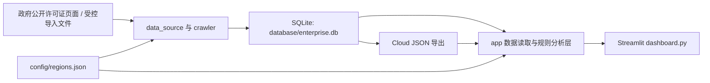

# 江苏区域企业融资机会雷达（V2 Demo）

一个面向银行客户经理的 Streamlit 演示系统：将政府公开的建设项目许可证整理为可按区域筛选、评分和跟进的企业融资机会线索。

> 当前仓库是 GitHub 展示版本。内置数据用于功能演示，不构成完整的政府许可名录、征信结论或银行授信建议。

## 项目介绍

系统围绕建设项目的许可阶段，帮助使用者快速回答三个问题：

1. 当前区域最近有哪些建设项目？
2. 哪些项目更可能对应企业融资机会？
3. 客户经理应关注什么产品和联系时间？

V2 Demo 保留 236 条许可证记录：

| 区域 | 记录数 |
|---|---:|
| 南通市海门区 | 225 |
| 南京市 | 4 |
| 苏州市 | 5 |
| 南通市其他区域 | 2 |
| 合计 | 236 |

新增区域数据来自政府公开页面的人工核验样本。这里的数量表示“当前已接入记录数”，不代表当地政府网站的许可证总量。

## 功能说明

- 省、市、区县三级区域选择，所有区域查询依据 `region_key` 隔离。
- 建设用地规划、建设工程规划、建设工程施工三类许可证查询。
- 企业、政府和未知主体的规则分类及可信度标记。
- 融资机会评分、机会等级、推荐贷款产品和营销时间窗口。
- 企业画像、工商 Excel 导入、信息完整度和企业实力判断。
- 可解释的企业融资分析与客户经理营销报告，支持 PDF 下载。
- 营销跟进记录、客户列表和状态筛选。
- 南京、苏州、南通其他区域的受控许可证数据导入。
- SQLite 主数据与 Cloud JSON 展示数据双读取链路。

融资评分、企业实力和营销建议均由本地规则生成。Demo 正常浏览不需要调用收费 AI API。

## 运行方式

### 环境要求

- Python 3.11 或 3.12
- Windows、macOS 或 Linux

### 安装

```powershell
git clone <your-repository-url>
cd project-radar
python -m venv .venv
.\.venv\Scripts\Activate.ps1
python -m pip install --upgrade pip
python -m pip install -r requirements.txt
```

macOS 或 Linux 激活环境时使用：

```bash
source .venv/bin/activate
```

### 启动 Dashboard

```powershell
python -m streamlit run dashboard.py --server.port 8502
```

浏览器访问：

```text
http://localhost:8502
```

### 运行测试

```powershell
python -m unittest discover -s tests
```

### 校验 Demo 数据

```powershell
python -c "import sqlite3; c=sqlite3.connect('database/enterprise.db'); print(c.execute('select count(*) from construction_permits').fetchone()[0]); c.close()"
```

预期输出：

```text
236
```

## 技术架构



核心目录：

```text
project-radar/
├─ app/                 # Dashboard 数据服务、画像、评分和报告逻辑
├─ config/              # 区域与数据来源配置
├─ crawler/             # 采集、导入、分类和 Cloud JSON 导出命令
├─ data/                # Demo JSON、来源样本与公开导出数据
├─ data_source/         # 许可证来源适配、校验和分类规则
├─ database/            # SQLite 正式 Demo 库与幂等迁移脚本
├─ docs/                # 各阶段设计、检查和完成报告
├─ tests/               # unittest 自动化测试
├─ dashboard.py         # Streamlit 入口
└─ requirements.txt     # Python 依赖
```

关键数据约定：

- 海门历史查询键继续使用 `region_key=320684`，不与现行行政区划代码混写。
- `source_region` 和 `source_time` 用于追踪区域数据来源。
- 正式 Demo 库为 `database/enterprise.db`；各阶段备份数据库不进入 Git。
- 区域来源只有在白名单和字段校验通过后才能导入。

## 截图位置

GitHub 展示截图统一放在：

```text
docs/screenshots/
```

建议文件名：

- `dashboard-overview.png`
- `enterprise-profile.png`
- `permit-search.png`

截图应使用演示数据，并避免包含本地路径、密钥、真实客户经理姓名或内部备注。

## 主要文档

- [V1 基线](docs/V1_BASELINE.md)
- [V2 Phase 0.5 检查](docs/V2_PHASE0_5_CHECK.md)
- [江苏区域配置报告](docs/V2_PHASE3_13_JIANGSU_REGIONS.md)
- [重点区域真实许可证接入报告](docs/V2_PHASE3_14_REAL_REGION_PERMITS.md)
- [Streamlit Cloud 部署说明](STREAMLIT_CLOUD.md)

## 数据与安全说明

- `.env`、Streamlit secrets、日志、浏览器调试文件和数据库备份已通过 `.gitignore` 排除。
- 不要在仓库中提交 API Key、Token、真实客户隐私或未经授权的工商数据。
- 当前 `company_registry` 中的企业信息为 Demo 验证数据，生产使用前应重新核验数据授权和准确性。
- 政府页面结构可能变化，扩大采集范围前应先验证来源、分页完整性和使用条款。

## 未来规划

- 按区县逐步扩展江苏官方许可证数据源，并增加数据新鲜度监控。
- 将人工核验导入升级为可审计的定时增量同步。
- 完善数据质量看板、来源失效告警和导入回滚能力。
- 增加多用户权限、部署配置和可观测性，为内部试点做准备。
- 在真实业务使用前完成数据合规、模型评估和人工复核流程。

## 当前发布状态

- 版本：V2 Demo Release
- 许可证记录：236
- 数据库完整性检查：`ok`
- 自动化测试：190 项
- 页面入口：`dashboard.py`

