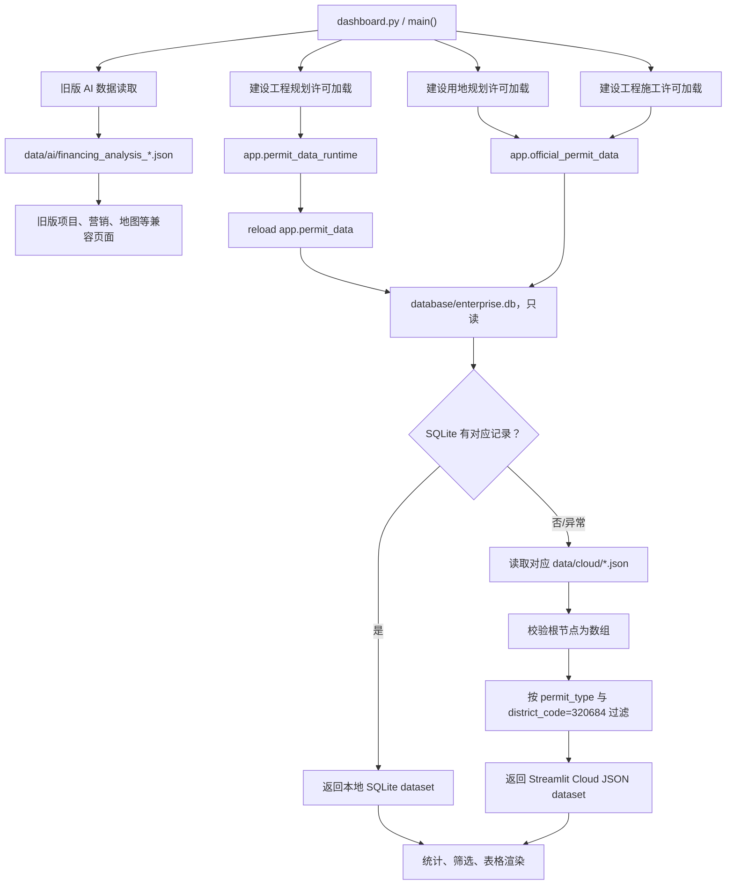

# V2 Phase 0.5 稳定性检查

## 1. 检查范围与结论

- 检查日期：2026-08-09（Asia/Shanghai）
- 检查目标：确认 V1 当前 Git、SQLite、Cloud JSON、Streamlit 读取链路及三类许可证模块，为 V2 地区参数化做只读准备
- 本阶段操作：只读检查并新增本文档
- 本阶段未执行：业务代码修改、数据库迁移、数据抓取、Cloud JSON 改写、Git 暂存、Git 提交、Git push

结论：V1 当前线上版本不会被本地 Phase 0.5 检查影响，但当前工作区不是干净基线，**不建议直接在当前混合工作区开始修改 V2 业务代码**。应先由用户确认未跟踪文件的取舍，建立本地保护性提交或独立 V2 分支，并备份被 Git 忽略的 SQLite；完成这些保护动作后，可以安全进入 Phase 1。

## 2. Git 状态

| 项目 | 当前值 |
|---|---|
| Branch | `main`，跟踪 `origin/main` |
| HEAD commit | `7b61da7a14d04c225f64cf62cfadedf113f57a7d` |
| Commit 时间 | `2026-07-23T20:07:06+08:00` |
| Commit 说明 | `修复Streamlit云端许可证模块导入` |
| 与本地 `origin/main` 的 ahead/behind | `0 / 0` |
| 工作区 | 不干净 |
| Git index lock | 无 |

当前未提交路径如下。`M` 为已跟踪文件的修改，`??` 为未跟踪文件；本文档生成后也属于未跟踪文件。

```text
 M tests/test_dashboard_smoke.py
?? .github/workflows/daily_crawler.yml
?? V2_IMPLEMENTATION_PLAN.md
?? crawler/run_construction_start_permit.py
?? crawler/run_planning_land_permit.py
?? data/ai/financing_analysis_2026-07-21_132634.json
?? data/licenses/.gitkeep
?? data/opportunities/enterprise_opportunities_2026-07-21_132634.json
?? data/opportunities/multi_source_report_2026-07-21_132634.json
?? data/reports/ownership_classification_report.csv
?? data_source/construction_start_permit.py
?? data_source/official_permit_record.py
?? data_source/planning_land_permit.py
?? database/official_permits.py
?? docs/DAILY_CRAWLER_REVIEW.md
?? docs/REGION_HARDCODE_REPORT.md
?? docs/UNTRACKED_FILE_REVIEW.md
?? docs/V1_BASELINE.md
?? docs/V2_PHASE0_5_CHECK.md
?? run_multi_source.ps1
?? tests/test_official_permit_modules.py
```

### 是否可以安全进入 V2

结论是“**有条件可以，但当前不宜直接开始业务代码修改**”。进入 Phase 1 前建议执行但本阶段不执行：

1. 审核并分别处理源码、文档、工作流与生成数据，避免把时间戳快照混入 V2 基线。
2. 为 Phase 0/0.5 建立可回退的本地提交，并从该提交新建 `v2/phase1-region-parameterization` 分支。
3. 保持 Streamlit Cloud 继续部署 `main`；V2 分支未经完整测试和人工确认不得合并或 push 到线上分支。
4. 单独备份 `database/enterprise.db`；该文件被 Git 忽略，Git 分支不能保护它。
5. 修正并审查未跟踪的 `daily_crawler.yml` 后再决定是否纳入版本控制。

## 3. SQLite 当前结构

- 文件：`database/enterprise.db`
- Schema 版本：`4`
- 检查方式：SQLite URI `mode=ro` 只读连接
- 业务表：5 张
- SQLite 内部表：1 张

### `construction_permits`（225 行）

| 字段 | 类型 | 约束/默认值 |
|---|---|---|
| `id` | INTEGER | PRIMARY KEY |
| `record_hash` | TEXT | NOT NULL，UNIQUE |
| `company_name` | TEXT | NOT NULL |
| `project_name` | TEXT | NOT NULL |
| `permit_type` | TEXT | NOT NULL |
| `permit_date` | TEXT | NOT NULL |
| `address` | TEXT | NOT NULL |
| `investment` | TEXT | NOT NULL |
| `score` | INTEGER | NOT NULL |
| `source` | TEXT | NOT NULL |
| `construction_unit` | TEXT | NOT NULL |
| `permit_number` | TEXT | NOT NULL |
| `project_scale` | TEXT | NOT NULL |
| `industry` | TEXT | NOT NULL |
| `update_time` | TEXT | NOT NULL |
| `project_stage` | TEXT | NOT NULL |
| `customer_level` | TEXT | NOT NULL |
| `raw_json` | TEXT | NOT NULL |
| `created_at` | TEXT | NOT NULL |
| `updated_at` | TEXT | NOT NULL |
| `publish_date` | TEXT | NOT NULL，默认 `未披露` |
| `issuing_authority` | TEXT | NOT NULL，默认 `未披露` |
| `district` | TEXT | NOT NULL，默认 `未披露` |
| `district_code` | TEXT | NOT NULL，默认 `未披露` |
| `source_url` | TEXT | NOT NULL，默认空字符串 |
| `source_name` | TEXT | NOT NULL，默认 `未披露` |
| `fresh_score` | INTEGER | NOT NULL，默认 `0` |
| `first_seen_at` | TEXT | NOT NULL，默认空字符串 |
| `last_seen_at` | TEXT | NOT NULL，默认空字符串 |
| `owner_name` | TEXT | NOT NULL，默认 `未披露` |
| `owner_category` | TEXT | NOT NULL，默认 `unknown` |
| `ownership_type` | TEXT | NOT NULL，默认 `unknown` |
| `ownership_confidence` | INTEGER | NOT NULL，默认 `0` |
| `ownership_basis` | TEXT | NOT NULL，默认“建设单位信息不足，无法判断所有制” |
| `marketing_eligible` | INTEGER | NOT NULL，默认 `0` |
| `marketing_priority` | TEXT | NOT NULL，默认 `待核验` |
| `exclusion_reason` | TEXT | NOT NULL，默认空字符串 |
| `manual_review_required` | INTEGER | NOT NULL，默认 `1` |
| `classification_updated_at` | TEXT | NOT NULL，默认空字符串 |

地区字段重点确认：

| 目标字段 | 当前状态 |
|---|---|
| `province` | 不存在 |
| `city` | 不存在 |
| `district` | 已存在 |
| `area_code` | 不存在；当前只有兼容字段 `district_code` |
| `source_area_code` | 不存在 |

### `crawler_runs`（0 行）

| 字段 | 类型 |
|---|---|
| `id` | INTEGER PRIMARY KEY |
| `run_started_at` | TEXT NOT NULL |
| `run_finished_at` | TEXT NOT NULL |
| `source` | TEXT NOT NULL |
| `fetched_count` | INTEGER NOT NULL |
| `inserted_count` | INTEGER NOT NULL |
| `updated_count` | INTEGER NOT NULL |
| `total_count` | INTEGER NOT NULL |
| `status` | TEXT NOT NULL |
| `error_message` | TEXT NOT NULL |
| `metadata_json` | TEXT NOT NULL |

### `enterprise_opportunities`（0 行）

| 字段 | 类型 |
|---|---|
| `id` | INTEGER PRIMARY KEY |
| `record_hash` | TEXT NOT NULL UNIQUE |
| `enterprise_name` | TEXT NOT NULL |
| `project_name` | TEXT NOT NULL |
| `source` | TEXT NOT NULL |
| `event_time` | TEXT NOT NULL |
| `amount` | TEXT NOT NULL |
| `industry` | TEXT NOT NULL |
| `region` | TEXT NOT NULL |
| `opportunity_level` | TEXT NOT NULL |
| `recommended_loan_product` | TEXT NOT NULL |
| `approval_type` | TEXT NOT NULL |
| `stage` | TEXT NOT NULL |
| `source_url` | TEXT NOT NULL |
| `source_title` | TEXT NOT NULL |
| `publish_time` | TEXT NOT NULL |
| `update_time` | TEXT NOT NULL |
| `fresh_score` | INTEGER NOT NULL |
| `opportunity_score` | REAL NOT NULL |
| `land_area` | TEXT NOT NULL |
| `construction_location` | TEXT NOT NULL |
| `manager_view_json` | TEXT NOT NULL |
| `raw_json` | TEXT NOT NULL |
| `created_at` | TEXT NOT NULL |
| `updated_at` | TEXT NOT NULL |

### `permit_ai_analyses`（10 行）

| 字段 | 类型 |
|---|---|
| `id` | INTEGER PRIMARY KEY |
| `permit_id` | INTEGER NOT NULL UNIQUE，外键指向 `construction_permits.id` |
| `input_hash` | TEXT NOT NULL |
| `ai_opportunity_level` | TEXT NOT NULL |
| `financing_need` | TEXT NOT NULL |
| `recommended_products_json` | TEXT NOT NULL |
| `marketing_summary` | TEXT NOT NULL |
| `visit_suggestion` | TEXT NOT NULL |
| `reasoning_summary` | TEXT NOT NULL |
| `confidence` | INTEGER NOT NULL |
| `risk_notice` | TEXT NOT NULL |
| `api_model` | TEXT NOT NULL |
| `analyzed_at` | TEXT NOT NULL |
| `updated_at` | TEXT NOT NULL |

### `schema_meta`（1 行）

| 字段 | 类型 |
|---|---|
| `key` | TEXT PRIMARY KEY |
| `value` | TEXT NOT NULL |

当前记录为 `schema_version=4`。

### `sqlite_sequence`（SQLite 内部表，3 行）

| 字段 | 类型 |
|---|---|
| `name` | SQLite 内部字段 |
| `seq` | SQLite 内部字段 |

### 建议 migration 方案（仅设计，不执行）

建议以 Schema 5 增量迁移实现，不删除或重建现有表：

1. 迁移前复制数据库并记录文件校验值、表行数及三类许可证数量。
2. 在单一事务内向 `construction_permits` 增加：
   - `province TEXT NOT NULL DEFAULT '江苏省'`
   - `city TEXT NOT NULL DEFAULT '南通市'`
   - `area_code TEXT NOT NULL DEFAULT '320684'`
   - `source_area_code TEXT`，允许为空，避免给没有来源地区参数的数据源伪造代码
3. 保留现有 `district` 和 `district_code`，V1 继续读取；`area_code` 初期由 `district_code` 显式回填，不立即重命名旧字段。
4. 对现有海门记录显式回填 `province='江苏省'`、`city='南通市'`、`district='海门区'`、`area_code='320684'`。
5. `source_area_code` 按数据源能力回填：建设工程规划许可证使用真实搜索参数 `320684`；建设用地规划与南通市施工许可来源没有同等的请求地区参数，保持 `NULL`，由来源 capability 描述覆盖范围。
6. 新建 `(area_code, permit_type, permit_date)`、`(area_code, source_url)` 等组合索引。
7. 新写入和查重必须把 `area_code` 纳入逻辑。当前 `record_hash` 全局唯一且查重没有地区条件，不能直接支持跨地区同号或同名记录；修改唯一策略前必须先做重复冲突审计。
8. 更新 `schema_meta` 到 `5`，运行全量测试和 V1 海门数量回归；失败则回滚事务并恢复备份。

## 4. Cloud JSON 当前结构

三个正式文件的根节点目前都是 **JSON 数组**，不是带元数据的对象。

### `planning_construction_permits.json`（205 条）

记录字段：

```text
company_name, project_name, permit_type, permit_number, permit_date,
publish_date, project_address, issuing_authority, district, district_code,
source_url, source_name, fresh_score, first_seen_at, last_seen_at,
owner_name, owner_category, ownership_type, ownership_confidence,
ownership_basis, marketing_eligible, marketing_priority, exclusion_reason,
manual_review_required, classification_updated_at, ai_opportunity_level,
financing_need, recommended_products, marketing_summary, visit_suggestion,
reasoning_summary, confidence, risk_notice
```

### `planning_land_permits.json`（19 条）

记录字段：

```text
company_name, project_name, permit_type, permit_number, permit_date,
publish_date, project_address, issuing_authority, district, district_code,
source_url, source_name, fresh_score, first_seen_at, last_seen_at
```

### `construction_start_permits.json`（1 条）

记录字段：

```text
company_name, project_name, permit_type, permit_number, permit_date,
publish_date, project_address, issuing_authority, district, district_code,
source_url, source_name, fresh_score, first_seen_at, last_seen_at
```

### 增加地区字段的兼容性

未来向每条记录增量加入 `province`、`city`、`district`、`region_key`，**不会直接影响当前 Streamlit**，原因是读取器将每条记录作为字典处理，使用既有字段和 `.get()`，额外字段会被保留或忽略。

必须遵守以下兼容条件：

1. 根节点继续保持数组；当前加载器遇到对象根节点会返回空列表。
2. 保留 `permit_type`、`district_code` 和其他现有展示字段；当前读取器仍硬编码过滤 `district_code == '320684'`。
3. 不要仅用 `region_key` 替换 `district_code`，应在 V1/V2 过渡期双写。
4. 字段类型保持稳定，特别是 `recommended_products` 必须继续为数组。
5. 若未来需要根级 `schema_version/generated_at`，应先升级读取器兼容“旧数组 + 新对象”两种格式，再改变导出格式。

## 5. Streamlit 当前读取链路

`dashboard.py` 启动时每次执行以下加载：

- 旧版项目页：`data/ai/financing_analysis_*.json`
- 建设工程规划许可：`load_planning_permit_dataset(database, cloud_json)`
- 建设用地规划许可：`load_official_permit_dataset(..., permit_type='建设用地规划许可证')`
- 建设施工许可：`load_official_permit_dataset(..., permit_type='建设工程施工许可证')`

许可证读取优先级一致：**SQLite 有匹配记录时使用 SQLite；SQLite 不存在、结构不满足、读取异常或没有匹配记录时回退对应 Cloud JSON。** SQLite 使用 `mode=ro` 只读连接。



### SQLite、JSON 与缓存结论

- 本地开发：数据库存在且有记录时通常读取 SQLite。
- Streamlit Cloud：SQLite 被 `.gitignore` 排除，部署环境通常依赖 Git 中的 `data/cloud/*.json`。
- 当前没有 `st.cache_data`、`st.cache_resource`、`lru_cache` 或 TTL 缓存。
- `app/permit_data_runtime.py` 的 `reload()` 是热部署兼容措施，不是数据缓存。
- 每次 Streamlit rerun 都会重新读取文件或数据库。
- 高风险差异：建设工程规划许可的 SQLite SQL 只按 `permit_type` 过滤，没有地区条件；另外两类 SQLite 和三个 Cloud JSON 路径都固定过滤 `district_code='320684'`。多地区数据写入前必须先修复该差异。

## 6. 三个许可证模块

### 建设用地规划许可证

| 项目 | 当前实现 |
|---|---|
| 数据源模块 | `data_source/planning_land_permit.py` |
| 记录模型 | `data_source/official_permit_record.py::OfficialPermitRecord` |
| CLI 入口 | `crawler/run_planning_land_permit.py::main()` |
| 执行函数 | `crawler/run_planning_land_permit.py::run()` |
| 采集入口 | `PlanningLandPermitCrawler.collect()` |
| 数据源 | 海门区自然资源局行政许可 TrueCMS 栏目 |
| 当前支持地区 | 仅海门区；`fixed_district='海门区'`、`fixed_district_code='320684'`，详情再执行海门置信度校验 |

公开数据字段：`company_name`、`project_name`、`permit_type`、`permit_number`、`permit_date`、`publish_date`、`project_address`、`issuing_authority`、`district`、`district_code`、`source_url`、`source_name`、`fresh_score`。入库模型另含 `construction_unit`、`project_scale`、`investment_amount`、`industry`、`project_stage`、`source_title`、海门匹配原因/置信度和 `raw`。

### 建设工程规划许可证

| 项目 | 当前实现 |
|---|---|
| 数据源模块 | `data_source/planning_construction_permit.py` |
| 浏览器回退 | `data_source/planning_construction_permit_browser.py` |
| CLI 入口 | `crawler/run_license.py::main()`，参数 `--import-planning-construction` |
| 执行函数 | `run_planning_construction_import()` |
| 采集入口 | `PlanningConstructionPermitCrawler.collect_all_search_items()`、`fetch_detail()`；接口异常时调用浏览器采集器 |
| 数据源 | 江苏自然资源政务信息检索服务 |
| 当前支持地区 | 仅海门区；`SEARCH_AREA_CODE='320684'` 固定写入请求、浏览器 URL、页面校验、记录和归属证据 |

记录模型字段：`title`、`publish_date`、`publisher`、`detail_url`、`area_code`、`construction_unit`、`company_name`、`project_name`、`project_address`、`permit_name`、`permit_number`、`issue_date`、`issuing_authority`、`source_url`、`source_name`、`district`、`district_code`、`category`、`image_urls`、`detail_loaded`、`ocr_used`、`haimen_confidence`、`haimen_reason`、`raw`。Cloud 导出还会合并主体分类和可选 AI 分析字段。

### 建设工程施工许可证

| 项目 | 当前实现 |
|---|---|
| 数据源模块 | `data_source/construction_start_permit.py` |
| 记录模型 | `data_source/official_permit_record.py::OfficialPermitRecord` |
| CLI 入口 | `crawler/run_construction_start_permit.py::main()` |
| 执行函数 | `crawler/run_construction_start_permit.py::run()` |
| 采集入口 | `ConstructionStartPermitCrawler.collect()` |
| 数据源 | 南通市数据局批准结果 TrueCMS 栏目 |
| 当前支持地区 | 仅输出海门；来源本身是南通市范围，先用海门及乡镇标题词预筛，再解析详情，只有海门归属置信度不低于 80 的记录可入库；最终记录强制写 `海门区/320684` |

公开及入库字段与建设用地规划许可证使用同一 `OfficialPermitRecord` 模型。

## 7. V2 改造风险分级

### 高风险文件

这些文件直接决定 V1 数据读取、地区隔离、写入、查重或线上入口；修改错误可能导致线上空数据、跨地区串数据或覆盖旧记录。

- `dashboard.py`
- `app/permit_data.py`
- `app/official_permit_data.py`
- `database/storage.py`
- `database/official_permits.py`
- `data_source/official_permit_record.py`
- `data_source/permit_validation.py`
- `data_source/planning_construction_permit.py`
- `data_source/planning_construction_permit_browser.py`
- `data_source/planning_land_permit.py`
- `data_source/construction_start_permit.py`
- `crawler/run_license.py`

高风险原因主要包括：固定 `320684` SQL/JSON 过滤、全局唯一 `record_hash`、查重缺少地区条件、强制写海门字段、Cloud JSON 旧格式依赖、V1 页面启动即加载全部数据。

### 中风险文件

这些文件会影响通用采集上下文、导出、日常任务、来源识别或热部署兼容，通常不会单独破坏表结构，但可能造成错误地区归属或数据停更。

- `app/permit_data_runtime.py`
- `app/dashboard_data.py`
- `app/permit_ownership.py`
- `data_source/base.py`
- `data_source/jiangsu_license.py`
- `data_source/jiangsu_natural_resource.py`
- `data_source/construction.py`
- `data_source/multi_source_runner.py`
- `crawler/run_planning_land_permit.py`
- `crawler/run_construction_start_permit.py`
- `crawler/export_cloud_data.py`
- `crawler/run_daily.py`
- `.github/workflows/daily_crawler.yml`

### 低风险文件

这些文件主要是显示文本、说明、静态配置或测试辅助；仍需测试，但对 V1 数据本体影响较低。

- `app/enterprise_map.py`
- `data_source/investment_project.py`
- `config/sites.json`
- `README.md`
- `STREAMLIT_CLOUD.md`
- `docs/*.md`
- 测试文件与 fixture（前提是不作为生产运行入口）

## 8. 回归验证状态

- Phase 0 在当前相同业务代码状态下完成过完整测试：82/82 通过。
- Phase 0.5 再次运行 82 项测试时，6 个 Streamlit 页面烟雾测试继续通过；27 项需要写入临时 SQLite、JSON、CSV 或 XLSX 的测试因受限临时目录报 `PermissionError` / `unable to open database file`。
- 这些错误发生在测试 fixture 创建或清理阶段，不是断言失败，也没有写入正式数据库。
- 已申请在非沙箱专用临时目录重跑，但审批通道断开而未获准；本报告不把这次环境失败记为业务回归，也不虚报为一次新的全量通过。
- 本阶段没有修改任何被应用导入的业务代码，所以仍以 Phase 0 的 82/82 完整通过作为当前 V1 代码基线证据。

## 9. Phase 1 前置保护清单

进入 Phase 1 前应由用户确认以下事项：

- [ ] 哪些未跟踪源码和测试纳入 V2 基线
- [ ] 时间戳数据快照继续保留但不作为 V2 正式 Cloud 数据
- [ ] 是否建立本地 Phase 0/0.5 保护性提交
- [ ] 是否新建独立 V2 分支并保持线上 `main` 不动
- [ ] 是否备份 `database/enterprise.db`
- [ ] Schema 5 migration 方案是否批准，但仍在 Phase 1 前不执行
- [ ] Cloud JSON 过渡期保持根数组和 `district_code` 兼容字段

Phase 0.5 到此停止。
