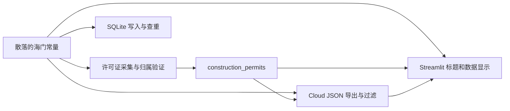

# V2 Phase 1.1 区域配置基础架构设计

## 1. 阶段目标与边界

本阶段把“海门企业雷达”升级为“区域可配置企业融资机会雷达”的配置基线，但不把新配置接入运行时代码。

本阶段实际变更仅有：

- 新增 `config/regions.json`
- 新增 `docs/V2_PHASE1_1_DESIGN.md`

本阶段明确不执行：

- 不删除或改写任何海门数据
- 不修改 `dashboard.py` 或 Streamlit 展示逻辑
- 不修改许可证采集、校验、写入或导出逻辑
- 不执行 SQLite migration
- 不改变 Cloud JSON
- 不提交、不 push

## 2. 当前架构

### 2.1 当前地区模型

V1 没有独立的区域配置对象。地区信息分散在以下位置：

- 数据源请求参数：例如 `areaCode=320684`
- 许可证模型默认值：`district='海门区'`、`district_code='320684'`
- SQLite 查询和 Cloud JSON 过滤：固定 `district_code='320684'`
- 数据源归属验证：固定海门名称、别名、乡镇和发证机关
- Streamlit 标题、导航和来源显示：固定海门文本
- crawler CLI、日志和 AI 提示词：固定海门文本

当前链路可概括为：



### 2.2 Phase 1.1 区域配置

新增 `config/regions.json`，当前内容严格按单地区对象保存：

```json
{
  "region_key": "320684",
  "province": "江苏省",
  "city": "南通市",
  "district": "海门区",
  "area_code": "320684"
}
```

字段语义：

| 字段 | 含义 | 当前值 |
|---|---|---|
| `region_key` | 应用内部稳定地区键 | `320684` |
| `province` | 省级名称 | `江苏省` |
| `city` | 地级市名称 | `南通市` |
| `district` | 区县名称 | `海门区` |
| `area_code` | 标准行政区划代码 | `320684` |

当前文件是海门兼容基线，尚未被任何 Python 或 Streamlit 模块读取，因此不会改变 V1 行为。

### 2.3 未来多地区扩展

南京、苏州、无锡、常州等地区不能通过猜测代码或复制海门采集规则直接启用。新增地区必须先确认：

1. 标准行政区划代码及内部 `region_key`。
2. 每个数据源是否支持该地区，以及数据源实际使用的地区参数。
3. 许可证详情页的地区归属证据规则。
4. Cloud JSON 和 SQLite 的地区隔离测试。

用户指定的当前 JSON 是单对象格式，只能表达一个默认地区。下一阶段若需要同一文件容纳多个地区，加载器应先兼容当前对象，再引入如下版本化容器；Phase 1.1 不改当前文件格式：

```json
{
  "schema_version": 2,
  "default_region_key": "320684",
  "regions": [
    {
      "region_key": "320684",
      "province": "江苏省",
      "city": "南通市",
      "district": "海门区",
      "area_code": "320684"
    }
  ]
}
```

## 3. 数据库变化设计

### 3.1 当前状态

- 数据库：`database/enterprise.db`
- 当前 Schema：4
- `construction_permits`：225 行
- 已有字段：`district`、`district_code`
- 缺少字段：`province`、`city`、`region_key`、`area_code`

任务要求中的 `district` 已经存在，因此 migration 必须先检查 `PRAGMA table_info(construction_permits)`，不得再次添加同名字段。

### 3.2 Schema 5 migration 方案

本阶段只设计，不生成可执行 migration 文件，也不执行 SQL。

建议步骤：

1. 迁移前备份 `enterprise.db`，记录文件校验值、总行数和三类许可证数量。
2. 确认数据库 `schema_version=4`，并确认所有现有正式记录确属海门；如果存在非海门或无法判断记录，停止迁移并人工核验。
3. 开启单一事务。
4. 只增加缺失字段：
   - `province TEXT`
   - `city TEXT`
   - `region_key TEXT`
   - `area_code TEXT`
5. 保留现有 `district`、`district_code`，避免破坏 V1 读取链路。
6. 只对已确认的海门记录进行回填：
   - `province='江苏省'`
   - `city='南通市'`
   - `district='海门区'`
   - `region_key='320684'`
   - `area_code='320684'`
7. 回填条件使用现有证据，例如 `district_code='320684'` 或 `district='海门区'`；不能无条件把未来非海门记录标成海门。
8. 验证回填前后总行数、许可证分类数量、主键和 `record_hash` 完全不变。
9. 新建查询索引：`(region_key, permit_type, permit_date)` 和 `(area_code, source_url)`。
10. 更新 `schema_meta` 为 `schema_version=5`，提交事务。
11. 运行全量测试、海门页面烟雾测试和 SQLite/Cloud JSON 数量对比；任一验证失败即回滚并恢复备份。

### 3.3 兼容策略

- V1 继续使用 `district` 和 `district_code`，Schema 5 初期双写新旧字段。
- `region_key` 是应用内部地区键；当前与 `area_code` 相同，但设计上不要求永远相同。
- 本阶段不修改 `record_hash` 或唯一约束。跨地区写入前必须另行审查全局唯一哈希和不带地区的查重逻辑。
- SQLite 的 `ALTER TABLE ADD COLUMN` 不应直接带海门默认值，否则未来数据库中未识别记录可能被错误标记；建议先允许空值、按证据回填，再由应用层保证新写入非空。
- 如未来需要数据库级 `NOT NULL`，应在数据验证完成后通过受控重建表实现，不应在本次兼容迁移中冒险。

### 3.4 migration 伪代码

以下只表达顺序，不在 Phase 1.1 执行：

```sql
BEGIN IMMEDIATE;

-- 先由 migration 代码检查字段是否存在，再执行缺失项：
ALTER TABLE construction_permits ADD COLUMN province TEXT;
ALTER TABLE construction_permits ADD COLUMN city TEXT;
ALTER TABLE construction_permits ADD COLUMN region_key TEXT;
ALTER TABLE construction_permits ADD COLUMN area_code TEXT;

UPDATE construction_permits
SET province = '江苏省',
    city = '南通市',
    district = '海门区',
    region_key = '320684',
    area_code = '320684'
WHERE district_code = '320684' OR district = '海门区';

CREATE INDEX IF NOT EXISTS idx_permit_region_type_date
ON construction_permits(region_key, permit_type, permit_date);

CREATE INDEX IF NOT EXISTS idx_permit_area_source
ON construction_permits(area_code, source_url);

-- 完成行数和空值验证后才更新 schema_meta 并 COMMIT。
```

## 4. 数据读取层改造方案

Phase 1.1 不修改以下代码；这里只列出下一阶段需要接入 `RegionConfig` 的位置。

### 4.1 `app/permit_data.py`

| 位置 | 当前行为 | 后续改造 |
|---|---|---|
| `load_planning_permit_dataset()` | 只接收数据库和 JSON 路径 | 增加 `region` 参数，但默认加载海门配置以保持兼容 |
| `_load_sqlite()` | SQL 只按 `permit_type` 查询，没有地区过滤 | Schema 5 执行后按 `region_key` 查询；过渡期可回退 `district_code` |
| `_load_cloud_json()` | 固定 `item.get('district_code') == '320684'` | 使用 `region.area_code`，同时兼容旧 JSON 的 `district_code` |
| `_normalize_item()` | 不保证标准地区字段 | 保留额外字段，并补充旧数据的海门兼容映射 |

重要风险：建设工程规划许可证的 SQLite 读取目前没有地区条件。多地区数据进入数据库前必须先改，否则会把其他地区记录混入海门页面。

### 4.2 `app/dashboard_data.py`

| 位置 | 当前行为 | 后续改造 |
|---|---|---|
| `load_records()` | 加载全部旧 AI JSON，不接收地区 | 可选接收 `RegionConfig`，但旧文件缺少地区字段时仍按 V1 兼容处理 |
| `_source_from_url()` | `haimen.gov.cn` 固定显示“海门区政府网站” | 来源名称由记录或 RegionConfig 生成；网站域名判断仅作为兼容回退 |
| `DashboardRecord.raw` | 可保留任意原始字段 | 下一阶段允许读取 `region_key/province/city/district`，但不改变现有页面字段 |

由于本阶段禁止修改 Streamlit 展示逻辑，`dashboard.py` 的标题、导航和页面结构不在 Phase 1.1 改动范围内。

### 4.3 crawler 模块

| 文件 | 固定地区点 | 后续 RegionConfig 接入方案 |
|---|---|---|
| `crawler/analyze_recent_permits.py` | AI 提示词固定“海门区” | `build_user_prompt()` 接收地区显示名 |
| `crawler/export_cloud_data.py` | 导出字段只有 `district_code` | Schema 5 后增量导出标准地区字段，保留旧字段 |
| `crawler/run_daily.py` | CLI 描述固定“海门企业雷达” | 统一入口读取默认 RegionConfig，暂不改变任务步骤 |
| `crawler/run_license.py` | 诊断、日志、CLI 帮助和 `areaCode=320684` 固定 | CLI 增加 `--region-key`；内部仍调用原采集器，不改变采集算法 |
| `crawler/run_planning_land_permit.py` | CLI 文案及来源隐含海门 | 读取 RegionConfig 并校验该来源是否支持选定地区 |
| `crawler/run_construction_start_permit.py` | CLI 文案及详情筛选隐含海门 | 读取 RegionConfig；地区证据规则仍由原适配器负责 |
| `crawler/classify_permit_owners.py` | 对全库运行 | Schema 5 后按 `region_key` 限定处理范围 |

相关但不在用户指定检查列表中的必要依赖：

- `app/official_permit_data.py`：当前 SQLite/JSON 都固定过滤 `district_code='320684'`。
- `database/storage.py`：当前写入和查重不带地区，规划许可证还强制写海门字段。
- `database/official_permits.py`：官方许可证查询和导出固定海门代码。
- `data_source/official_permit_record.py`：统一记录转换强制写 `海门区/320684`。
- 三个 `data_source/*permit.py`：地区能力和归属证据仍固定海门。

这些依赖必须在真正启用第二个地区前逐步参数化，但 Phase 1.1 不修改它们，也不改变现有许可证采集逻辑。

## 5. 修改文件清单

### Phase 1.1 实际新增

| 文件 | 作用 |
|---|---|
| `config/regions.json` | 海门默认区域配置基线 |
| `docs/V2_PHASE1_1_DESIGN.md` | 当前架构、migration、读取层改造和风险设计 |

### Phase 1.1 未修改

- 所有 `.py` 文件
- `dashboard.py`
- `database/enterprise.db`
- `data/cloud/*.json`
- 三类许可证采集器
- Streamlit 配置和 GitHub workflow

### 下一阶段候选文件

建议下一阶段仍保持“无新页面”边界，先实现只读配置加载：

- 新增 `data_source/region_context.py`
- 新增 `tests/test_region_config.py`
- 修改 `app/permit_data.py`
- 修改 `app/dashboard_data.py`
- 修改 `app/official_permit_data.py`
- 修改 crawler 入口参数与提示文本

数据库 migration 的可执行脚本应在单独阶段创建并经过备份/回滚测试后才允许执行。

## 6. 风险点

### 高风险

1. `construction_permits.record_hash` 全局唯一，当前查重不包含地区；直接写入其他地区可能错误合并记录。
2. 建设工程规划许可 SQLite 读取没有地区条件，第二地区数据可能串入海门页面。
3. 官方许可证查询、Cloud JSON 过滤和统一记录转换仍固定 `320684`。
4. 无条件回填新地区字段可能把未知或未来非海门记录错误标记为海门。
5. 修改 Cloud JSON 根结构会使当前 Streamlit 返回空数据。

### 中风险

1. 当前单对象 `regions.json` 不能直接表示多个地区，需要版本化兼容升级。
2. `district_code` 与新 `area_code` 在过渡期并存，必须定义明确的双写和读取优先级。
3. crawler 的地区参数与行政区划代码未必相同；未来应另设数据源 capability，不能假设所有站点都使用 `area_code`。
4. 旧 AI JSON 缺少地区字段，只能作为 V1 兼容输入，不能作为多地区正式数据源。

### 低风险

1. 当前新增配置尚未接入运行时，不会改变线上行为。
2. 配置和设计文档不参与 Streamlit 页面导入。
3. 本阶段没有写数据库或改 Cloud JSON，不会删除海门数据。

## 7. 下一阶段计划

建议 Phase 1.2 只完成“RegionConfig 只读加载与兼容传递”，仍不开发新页面：

1. 新增不可变 `RegionConfig` 数据类和严格 JSON 校验。
2. 加载器同时兼容 Phase 1.1 单对象格式和未来版本化多地区格式。
3. 默认地区继续为海门，配置缺失或非法时安全失败，不静默选择其他地区。
4. 为 `permit_data.py`、`dashboard_data.py`、`official_permit_data.py` 和 crawler 入口增加可选 `RegionConfig`，但保持默认调用结果与 V1 完全一致。
5. 增加单元测试：默认海门、非法字段、未知地区、旧 JSON 兼容和不同地区不混入。
6. 完整测试通过后停止，单独申请批准再生成并执行数据库 migration。

Phase 1.1 到此停止。
