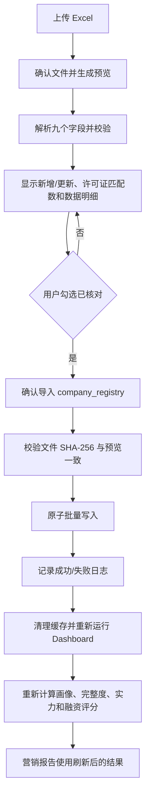

# V2 Phase 3.11 工商数据生产导入报告

## 1. 完成状态

Phase 3.11 已完成本项目正式 SQLite 数据库的工商数据导入流程与一次 10 家企业写入验证。

- 当前分支：`main`
- 基线提交：`7b61da7a14d04c225f64cf62cfadedf113f57a7d`
- Git push：未执行
- SQLite 完整性：`ok`
- 数据库 schema version：`11`
- `construction_permits`：225 条，未增删
- `company_registry`：由 0 条增加到 10 条
- `company_import_logs`：1 条成功日志

## 2. 正式导入流程

企业画像页面现在采用两次确认，预览阶段不会写数据库。

安全控制：

- Excel 必须包含既定九字段。
- 导入前展示逐行数据预览。
- 文件变化后原预览自动失效。
- 最终导入前必须勾选确认框。
- 文件 SHA-256 与预览不一致时拒绝写入并记录失败日志。
- 批量 upsert 在单个 SQLite 事务中执行，避免部分记录写入。
- `未披露`、`未知`、`建设单位暂未披露` 等占位名称禁止进入 `company_registry`。

## 3. 导入日志

新增表：`company_import_logs`。

字段：

- `id`
- `import_time`
- `file_name`
- `total_count`
- `success_count`
- `failed_count`
- `inserted_count`
- `updated_count`
- `status`
- `error_message`
- `file_sha256`

企业画像页面提供最近 10 次工商数据导入日志查看入口。

迁移脚本：`database/migrations/011_company_import_logs.py`。迁移可重复执行，并保护许可证、营销跟踪和工商表的已有记录数量。

## 4. 10 家企业正式写入验证

验证工作簿：`outputs/phase3_11/company_registry_production_verification_10.xlsx`。

真实性边界：10 个企业名称均来自当前海门区许可证记录；由于没有可靠工商材料，统一社会信用代码、法人、注册资本、成立日期、注册地址、经营范围、企业状态和行业均保持空白，没有构造测试事实。

导入前预览：

- 待导入：10 条
- 预计新增：10 条
- 预计更新：0 条
- 匹配许可证企业：10 家
- 关联许可证项目：29 个
- 未匹配企业：0 家

正式写入结果：

- 导入时间：`2026-08-10T18:36:36`
- 文件名称：`company_registry_production_verification_10.xlsx`
- 成功数量：10
- 失败数量：0
- 新增数量：10
- 更新数量：0
- 日志状态：`success`
- 文件 SHA-256：`267A69EEC2FE53BE3C1DD2DC480F67CAAB2C1B5C49B487E18686D65F6FC95441`

写入企业：

1. 平谦现代产业园（南通海门）有限公司
2. 武泽精淮营养科技（江苏）有限公司
3. 南通市海门正丰建设投资有限公司
4. 海门市华丰真空设备有限公司
5. 南通艾郎风电科技发展有限公司
6. 中天钢铁集团（南通）有限公司
7. 江苏祥耀新材料有限公司
8. 南亚新材料科技（江苏）有限公司
9. 欧派智能装备（南通）有限公司
10. 南民国昌路业有限公司

## 5. 刷新和覆盖率验证

正式写入后重新执行与 Dashboard 相同的数据链路：

`许可证读取 → 工商匹配 → 完整度 → 企业实力 → 融资评分 → 融资预测 → 授信分析 → 营销报告`

结果：

- 项目总数：225
- 已匹配企业数：10
- 已匹配企业项目：29
- 工商项目覆盖率：12.9%
- 企业画像：可生成
- 融资评分：可重新计算
- 营销报告：可生成全部 8 个章节

本次只核实企业名称，因此工商信息完整度仍为 `0% / D`。这不是联动失败，而是系统没有把未核实数据推测成真实工商字段。后续导入可靠工商材料后，完整度、企业实力和融资评分会按现有规则自动更新。

## 6. 测试环境

测试环境继续使用临时 SQLite 副本，不会清空或覆盖正式数据库。

新增测试覆盖：

- 预览阶段不写数据库。
- 二次确认后写入并记录成功日志。
- 文件指纹变化时拒绝导入并记录失败数量。
- 011 migration 幂等且保留已有数据。
- 10 家企业联动测试使用清空工商表后的独立数据库副本。
- Streamlit 上传后必须经过预览和确认，未确认时导入按钮不可用。
- 占位企业名称不能进入工商表。

完整回归：`177 tests`，全部通过。

测试输出中的 `use_container_width` 为 Streamlit 未来弃用提示，不影响本阶段功能；为避免超出范围，本阶段未做全页面 API 替换。

## 7. 备份和回滚

写入前备份：

`database/backups/enterprise_pre_phase3_11_20260810_183619.db`

- 备份 SHA-256：`4030D457991EA868D2E03079C13E78634E4694647F931792C3FE43A2FDD22F0D`
- 写入前数据库 SHA-256 与备份一致。
- 写入后数据库 SHA-256：`66DDA79EF801DFB47DE81D71060C15E5812ACFFF2B311E3151B7CADB09140D6F`

如需回滚，应先停止使用当前 SQLite 的进程，再用上述备份替换 `database/enterprise.db`。本阶段没有执行回滚。

## 8. 修改文件

- `app/company_import.py`
- `app/company_registry.py`
- `dashboard.py`
- `database/migrations/011_company_import_logs.py`
- `tests/test_company_import.py`
- `tests/test_company_import_migration.py`
- `tests/test_company_registry.py`
- `tests/test_company_registry_import_integration.py`
- `tests/test_dashboard_smoke.py`
- `outputs/phase3_11/company_registry_production_verification_10.xlsx`
- `docs/V2_PHASE3_11_PRODUCTION_IMPORT.md`

## 9. 部署边界

本次完成的是当前项目目录中 `database/enterprise.db` 的正式写入。该数据库受 `.gitignore` 中 `database/*.db` 规则排除，且本阶段没有 Git push，因此线上 Streamlit Cloud 实例不会因本次本地写入自动获得这 10 条记录。

如果下一阶段要求线上长期保存工商导入结果，需要单独设计持久化部署方案，例如受控数据库服务、持久卷或经过审计的数据库发布流程；不能把 Streamlit Cloud 临时文件系统当作长期生产存储。
