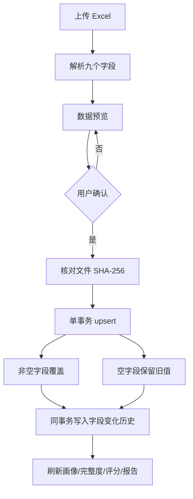

# V2 Phase 3.12 企业工商画像完善报告

## 1. 完成状态

Phase 3.12 已完成工商字段核对、Excel 字段覆盖更新、历史留痕、工商完整度、行业判断和企业画像展示增强。

- 当前分支：`main`
- 基线提交：`7b61da7a14d04c225f64cf62cfadedf113f57a7d`
- Git push：未执行
- SQLite 完整性：`ok`
- schema version：`12`
- `construction_permits`：225 条，迁移前后不变
- `company_registry`：10 条，企业名称及既有数据保留
- `company_registry_history`：正式库 0 条；测试库产生 80 条初始化字段历史
- 完整回归：184 项，全部通过

## 2. company_registry 字段核对

现有 `company_registry` 已具备本阶段要求的字段，因此没有创建同义或重复列：

- `company_name`：企业名称
- `unified_social_credit_code`：统一社会信用代码
- `legal_person`：法人
- `registered_capital`：注册资本
- `establish_date`：成立日期
- `company_address`：注册地址
- `business_scope`：经营范围
- `company_status`：企业状态
- `industry`：行业分类

“行业分类”继续复用数据库列 `industry`。Excel 现支持表头 `行业分类`，同时兼容 Phase 3.10/3.11 使用的旧表头 `行业`。

正式数据库的 10 家企业仍只有经许可证验证的企业名称，上述 8 个工商详情字段全部为空。本阶段没有把合成测试值写入正式库。

## 3. Excel 工商数据补充

正式导入流程仍为：

覆盖规则：

- 同名或规范化名称匹配后更新已有企业，不重复插入。
- Excel 非空字段可覆盖旧值。
- Excel 空白字段不会擦除已有数据。
- 相同值重复导入不会产生重复历史。
- upsert 与历史留痕位于同一个 SQLite 事务，任一环节失败即整体回滚。

## 4. 历史数据保留

新增表 `company_registry_history`，字段如下：

- `id`
- `company_name`
- `field_name`
- `old_value`
- `new_value`
- `change_type`
- `changed_at`
- `change_source`
- `import_file_name`
- `file_sha256`

迁移脚本：`database/migrations/012_company_registry_history.py`。

迁移可重复执行，且会检查 `construction_permits`、`marketing_records`、`company_registry`、`company_import_logs` 的行数不变。正式库迁移仅创建空历史表并把 schema version 更新为 12，没有修改工商详情和许可证记录。

## 5. 工商完整度

完整度继续按 8 个工商详情字段等权计算：统一社会信用代码、法人、注册资本、成立日期、注册地址、经营范围、企业状态、行业分类。

- A：90% 及以上
- B：70% 及以上、低于 90%
- C：50% 及以上、低于 70%
- D：低于 50%

由于当前恰好有 8 个等权字段，可出现的比例以 12.5 个百分点递增；因此 A 实际对应 8/8（100%），7/8 为 88% / B，6/8 为 75% / B，4/8 为 50% / C，3/8 为 38% / D。

## 6. 企业画像增强

企业画像页面现在明确展示：

- 企业基础信息：名称、统一社会信用代码、法人、注册资本、成立年份、注册地址、经营范围、状态、行业。
- 工商信息完整度及 A/B/C/D 等级。
- 企业规模判断及可解释依据。
- 行业判断、置信度及判断依据。
- 原有企业实力等级、融资评分、预计融资金额和推荐产品。

企业规模仍采用保守规则：优先读取明确披露的规模字段，其次使用从业人数作通用分层；没有可靠规模信息时保持“未知”，不把注册资本直接等同于法定企业规模。

行业判断规则：

- 工商导入已明确披露行业分类：保留原行业，高置信度。
- 未披露工商行业时：根据经营范围、项目名称、企业名称中的新能源、电子信息、装备、新材料、生物医药、食品、建筑和制造关键词进行中置信度归类。
- 没有可解释关键词：保持“待判断”/低置信度。

## 7. 10 家测试企业验证

测试工作簿：`outputs/phase3_12/company_registry_profile_test_10.xlsx`。

真实性边界：10 个企业名称来自当前许可证关联企业；其余工商字段全部是显式标注的合成测试值。工作簿的“测试说明”页明确禁止导入生产数据库或用于尽调/授信。

验证只在 `database/enterprise.db` 的临时副本中执行：

- 待导入：10 条
- 新增：0 条
- 更新：10 条
- 许可证企业匹配：10 家
- 字段变化历史：80 条（10 家 × 8 个详情字段）
- 10 家完整度：均为 100% / A
- 工商已披露行业：均为高置信度行业判断
- 企业实力：样例企业可由注册资本和成立时间形成非 D 级判断
- 融资评分：可重新计算
- 营销报告：可生成 8 个章节
- `construction_permits`：验证前 225 条，验证后 225 条

工作簿 SHA-256：`47C0EC9B7B4104A699C6BC561889D11B22DFDC49398ACB1707556B99B56AC40C`。

## 8. 备份与正式库结果

迁移前备份：`database/backups/enterprise_pre_phase3_12_20260810_185247.db`

- 备份 SHA-256：`66DDA79EF801DFB47DE81D71060C15E5812ACFFF2B311E3151B7CADB09140D6F`
- 迁移后数据库 SHA-256：`C83CB706CA2135CA3BD6461B6C20C05AAF30C63C6071CBA40C47936114154D4C`
- SQLite integrity check：`ok`
- `construction_permits`：225
- `company_registry`：10
- `company_import_logs`：1
- `company_registry_history`：0
- `marketing_records`：0

数据库哈希变化来自新增历史表、索引和 schema version 12。正式库没有执行 10 家合成数据导入。

## 9. 测试

新增或增强测试覆盖：

- `行业分类` 与旧 `行业` Excel 表头兼容。
- 非空字段覆盖、空字段保留旧值。
- 字段变化历史包含旧值、新值、来源、文件名和 SHA-256。
- 相同文件重复导入不重复写历史。
- 012 migration 幂等并保护许可证数据。
- 完整度 A/B/C/D 边界。
- 工商行业优先、关键词行业判断和信息不足分支。
- 10 家企业在隔离库中的画像、企业实力、融资评分和营销报告联动。
- Streamlit 企业画像表格和详情指标展示。

执行结果：`Ran 184 tests ... OK`。

测试输出中的 `use_container_width` 是 Streamlit 的既有弃用提示，本阶段未对全页面 API 进行大规模替换。

## 10. 修改文件

- `app/company_registry.py`
- `app/company_registry_history.py`
- `app/company_data_provider.py`
- `app/company_import.py`
- `app/industry_classification.py`
- `dashboard.py`
- `database/migrations/012_company_registry_history.py`
- `tests/test_company_registry.py`
- `tests/test_company_data_provider.py`
- `tests/test_company_registry_history.py`
- `tests/test_company_registry_history_migration.py`
- `tests/test_industry_classification.py`
- `tests/test_phase3_12_integration.py`
- `tests/test_dashboard_smoke.py`
- `outputs/phase3_12/company_registry_profile_test_10.xlsx`
- `docs/V2_PHASE3_12_ENTERPRISE_PROFILE.md`

## 11. 部署边界

- 未执行 Git push。
- 未调用收费 API。
- 未修改许可证采集逻辑。
- 未删除或重构现有海门数据链路。
- 本地 SQLite 迁移不会自动发布到 Streamlit Cloud；线上若需要 schema version 12，仍需受控部署数据库或在部署流程中执行 012 migration。
