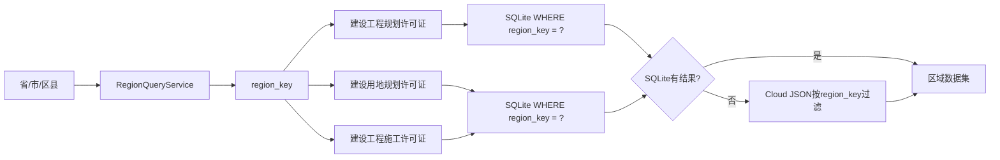

# V2 Phase 3.13 江苏省区域选择报告

## 1. 完成状态

Phase 3.13 已完成江苏省 13 个设区市、95 个县（市、区）的区域配置，并验证 Dashboard 三级联动与三类许可证按 `region_key` 严格过滤。

- 当前分支：`main`
- 基线提交：`7b61da7a14d04c225f64cf62cfadedf113f57a7d`
- Git push：未执行
- 数据库 migration：不需要
- `construction_permits`：225 条，未增删、未更新
- SQLite integrity check：`ok`
- 完整回归：188 项，全部通过

## 2. 行政区划来源

区域名称按江苏省人民政府公布的截至 2025 年 12 月 31 日行政区划核对：全省 13 个设区市、95 个县（市、区）。

- 名称来源：<https://www.jiangsu.gov.cn/col/col88749/index.html>
- 六位代码来源：<https://mzt.jiangsu.gov.cn/art/2023/4/25/art_78635_10994579.html>

配置文件的 `metadata` 保存了资料日期和来源地址，便于以后复核行政区划调整。

## 3. 区域配置

`config/regions.json` 已由单个海门对象扩展为 `regions` 数组，共 95 条。

| 设区市 | 县（市、区）数量 |
|---|---:|
| 南京市 | 11 |
| 无锡市 | 7 |
| 徐州市 | 10 |
| 常州市 | 6 |
| 苏州市 | 9 |
| 南通市 | 7 |
| 连云港市 | 6 |
| 淮安市 | 7 |
| 盐城市 | 9 |
| 扬州市 | 6 |
| 镇江市 | 6 |
| 泰州市 | 6 |
| 宿迁市 | 5 |
| 合计 | 95 |

南通市支持：崇川区、通州区、海门区、启东市、如东县、如皋市、海安市。

每条区域配置继续提供：

- `region_key`
- `province`
- `city`
- `district`
- `area_code`

海门兼容处理：

- 数据查询键 `region_key=320684` 保持不变，用于读取现有 225 条历史记录。
- `source_area_code=320684` 保留现有数据源兼容语义。
- `administrative_code=320614` 单独记录现行海门区行政区划代码。
- 没有把历史记录的 `region_key` 从 320684 批量改成 320614。

## 4. 区域查询服务

`app/region_service.py` 新增层级查询能力：

- `list_provinces()`
- `list_cities(province)`
- `list_districts(province, city)`
- `resolve_region_key(province, city, district)`
- `get_by_region_key(region_key)`

未知省、市、区县会显式抛出 `RegionNotFoundError`，避免回退到海门或返回错误地区的数据。

`RegionConfig` 同时支持 `administrative_code` 和 `source_area_code`；普通地区未配置时默认使用 `area_code`，海门使用显式双代码。

## 5. Dashboard 三级选择

首页和企业画像页继续使用：

```text
省 → 市 → 区县 → region_key → 三类许可证查询 → 企业画像/融资评分
```

本阶段增强：

- 首次进入仍默认江苏省 / 南通市 / 海门区，不会因南京位于配置数组首位而改变默认区域。
- 切换城市后，如果旧区县不属于新城市，自动选择新城市的第一个合法区县。
- 海门页面同时显示数据查询键 320684 和现行行政区划代码 320614。
- 选择状态继续保存在 Streamlit session state，首页与企业画像共享区域。

## 6. 数据查询链路

Dashboard 的正式数据读取链路没有使用城市名称模糊过滤，而是统一传递选中区域的 `region_key`：



验证过的读取函数：

- `load_planning_permit_dataset(..., region_key=...)`
- `load_official_permit_dataset(..., permit_type=..., region_key=...)`

SQLite 和 Cloud JSON 均要求记录的 `region_key` 与选择值相等，不会把海门数据当作南京或苏州数据返回。

## 7. 南京、苏州、南通海门验证

测试区域：

| 查询 | region_key | 建设工程规划 | 建设用地规划 | 建设施工 | 总计 |
|---|---|---:|---:|---:|---:|
| 江苏省 / 南京市 / 玄武区 | 320102 | 0 | 0 | 0 | 0 |
| 江苏省 / 苏州市 / 昆山市 | 320583 | 0 | 0 | 0 | 0 |
| 江苏省 / 南通市 / 海门区 | 320684 | 205 | 19 | 1 | 225 |

南京、苏州返回 0 是当前数据库尚未导入这些区域的数据，不是查询失败。系统不会为了展示数量而复用海门数据。

Dashboard 交互测试依次完成：

1. 默认南通市 / 海门区，项目总数 225。
2. 切换南京市 / 玄武区，项目总数 0。
3. 切换苏州市 / 昆山市，项目总数 0。
4. 切回南通市 / 海门区，项目总数恢复 225。

## 8. 历史数据保护

阶段前后数据库 SHA-256 均为：

`C83CB706CA2135CA3BD6461B6C20C05AAF30C63C6071CBA40C47936114154D4C`

正式数据库最终状态：

- `construction_permits`：225
- `region_key=320684`：225
- 其他 `region_key`：0
- 建设工程规划许可证：205
- 建设用地规划许可证：19
- 建设工程施工许可证：1

没有执行数据库写入、历史数据迁移、批量改码或测试数据导入。

## 9. 测试

新增或增强测试覆盖：

- 江苏省 13 个设区市顺序和数量。
- 95 个县（市、区）配置总数。
- 南京市 11 个区、苏州市 9 个县市区、南通市 7 个县市区。
- 南京玄武 `320102` 解析。
- 苏州昆山 `320583` 解析。
- 南通海门兼容键 `320684` 及行政代码 `320614`。
- 三类许可证 SQLite/Cloud JSON 严格按 `region_key` 过滤。
- Dashboard 城市与区县联动、空区域展示、切回海门恢复 225 条。
- 未知省市区县显式拒绝。

执行结果：`Ran 188 tests ... OK`。

测试中的 `use_container_width` 为 Streamlit 既有弃用提示，本阶段没有进行全页面大规模 API 重构。

## 10. 修改文件

- `config/regions.json`
- `app/region_service.py`
- `dashboard.py`
- `tests/test_region_service.py`
- `tests/test_phase3_13_region_queries.py`
- `tests/test_dashboard_smoke.py`
- `docs/V2_PHASE3_13_JIANGSU_REGIONS.md`

## 11. 后续边界

Phase 3.13 完成的是区域选择和查询隔离，不代表南京、苏州等 94 个新增配置区域已有许可证数据。

下一阶段如采集新地区，必须：

- 验证对应数据源的真实区域参数。
- 使用目标地区自己的 `region_key` 写入。
- 不复制或改写海门数据。
- 在正式导入前验证分页完整性、总数和来源真实性。

本阶段未 Git push。
